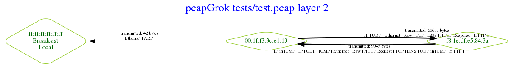
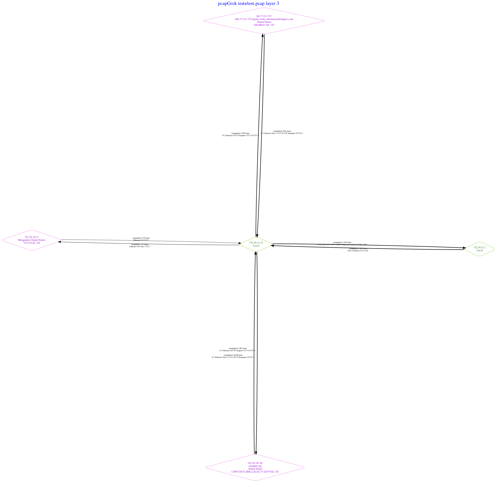
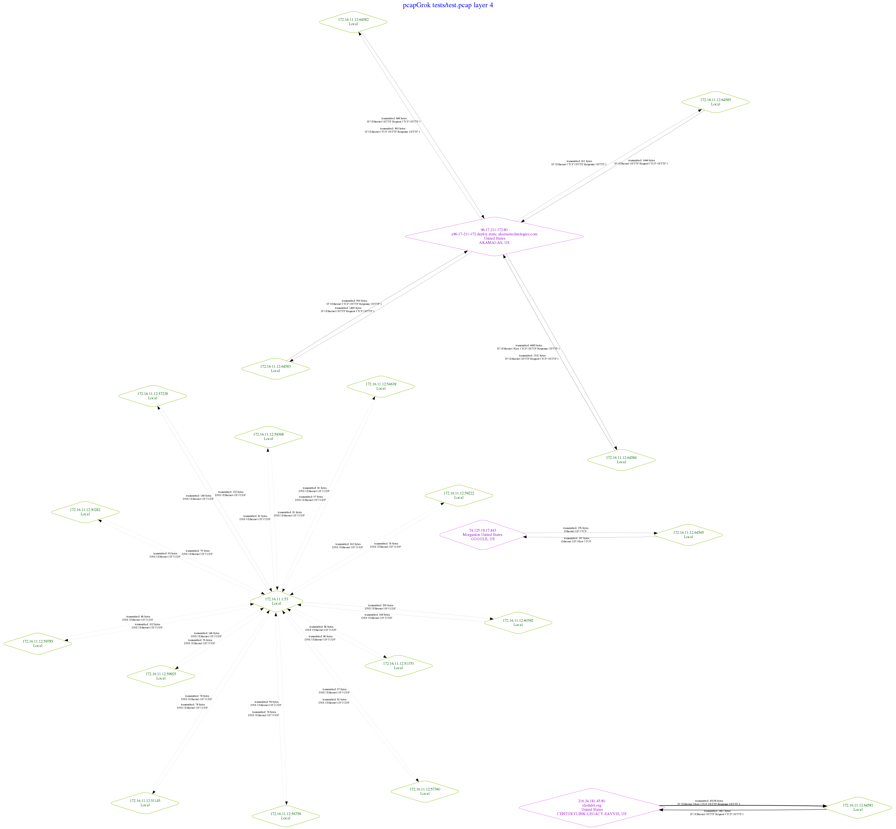

# pcapGrok

## Differences from PcapVis
pcapGrok is a hack based on PcapVis https://github.com/mateuszk87/PcapViz 
Enhancements include 
- additional display command line controls 
- default batch mode for multiple pcap files
- default all layers if no single layer requested.
- whois RDAP 'asn_description' data when geoIP and socket.getfqdn draw blanks.
- tables of traffic including all available identifying data for each host
- writes a log with lots of interesting notes as pcapgrok.log 
- wordclouds for all hosts (with 2 or more destinations) showing traffic weighted destinations
- optional tshark statistics and files - requires tshark to be installed - highly recommended

## RAM and patience will limit the size of input capture files - 100MB may be manageable but will use 2+G RAM
Understanding network traffic from IoT devices was the motivation for this code. It works readonably well for relatively small packet
capture files. A 6MB pcap file with 14K packets, 11 MAC addresses and 34 IP addresses is completed in about 50 seconds on a low end desktop.
However, a 100MB pcap with about 70k packets requires about 2G of RAM to process and as the graphs become more complex, correspondingly more RAM
will be used. It might work for a 1G file if you have a boatload of RAM but I cannot imagine what use a complex graph will be. It was 
not designed for large pcap files so please don't be surprised if it doesn't cope with really big graphs. You'll be wanting the whole
elastic backend thing with SecurityOnion or Malcolm for that. This is a toy by comparison but one that works fine for the small files needed to
disect newly configured IoT devices.

## Purposes
Network communication graphs show hosts as nodes and traffic as edges, making complex communications easier to understand sometimes. 
However, ip and mac addresses are for machines. Humans need additional information about the host such as country, domain registration and domain name if available.
Scapy has some inbuilt visualisations and they can probably be applied to filtered data but we wanted finer control over the graph layout and decent annotation of each node.
Seeing the packets at different layers is a good first level clarification and PcapVis provided the basis for this application. Mateusz' insight 
made PcapVis images far more comprehensible to me because drawing the information flows separately for each of three layers makes much more immediate sense.
Adding annotation to the graph labels and colouring remote nodes violet helps improve the utility of images. Filtering graphs on protocol and on mac addresses
helps focus on the traffic of interest, effectively reducing noise from irrelevant chatter among other devices during the packet capture period. The ability to filter on
protocol also helps simplify very complex graphs by breaking them down.

## Features
- Draws network topology graphs. Layer 2 = link, 3 = network, 4 = transport
- Graph node labels show host FQDN, country and city if available from maxminddb and socket.getfqdn. Otherwise "asn_description" from RDAP whois data is shown.
- fqdname/whois/geo lookup is threaded (supply -P for slower serial behaviour) and results are saved as cache file - can be reused. These are very informative when there is traffic to and from cloud providers, since they are nearly always identified. Violet nodes are outside the LAN. 
- Graph node colours are informative - yellow=broadcast, violet = remote, powderblue = LAN
- Edges drawn in thickness proportional to traffic volume
- Restricting by *mac address* allows focus on a single device at all layers. This removes noise and chatter from other devices obscuring the network graph of interest.
- Filtering by *protocol* using either whitelist or blacklist - eg ARP, UDP, NTP, RTP...
- Automatic *separated graphs by protocol* where the number of nodes exceeds NMAX (default is 100). Set to a small number (e.g. 2) to force splitting. Big graph is always drawn but they get pretty dense.
- Lists the most frequently contacted and frequently sending machines and identifying information
- command line choice of Graphviz graph layout engine such as dot or sfdp.
- optionally amalgamates all input pcap files into one before drawing graphs. Default is to draw graphs for each input pcap separately.
- optional wordclouds of destinations weighted by proportion of ip traffic. 

## Usage

```
usage: pcapGrok.py [-h] [-a] [-b [BLACKLIST [BLACKLIST ...]]]
                   [-E LAYOUTENGINE] [-fi] [-fo] [-g GRAPHVIZ] [-G GEOPATH]
                   [-hf HOSTSFILE] [-i [PCAPS [PCAPS ...]]] [-k KYDDBPATH]
                   [-l GEOLANG] [--layer2] [--layer3] [--layer4] [-n NMAX]
                   [-o OUTPATH] [-p PICTURES] [-P] [-S]
                   [-r [RESTRICT [RESTRICT ...]]] [-s SHAPE] [-T]
                   [-w [WHITELIST [WHITELIST ...]]] [-W]

Network packet capture (standard .pcap file) topology and message mapper.
Optional protocol whitelist or blacklist and mac restriction to simplify
graphs. Draws all 3 layers unless a single one is specified

optional arguments:
  -h, --help            show this help message and exit
  -a, --append          Append multiple input files before processing as
                        PcapVis previously did. New default is to batch
                        process each input pcap file separately.
  -b [BLACKLIST [BLACKLIST ...]], --blacklist [BLACKLIST [BLACKLIST ...]]
                        Blacklist of protocols - NONE of the packets having
                        these layers shown eg DNS NTP ARP RTP RIP
  -E LAYOUTENGINE, --layoutengine LAYOUTENGINE
                        Graph layout method - dot, sfdp etc.
  -fi, --frequent-in    Print frequently contacted nodes to stdout
  -fo, --frequent-out   Print frequent source nodes to stdout
  -g GRAPHVIZ, --graphviz GRAPHVIZ
                        Graph will be exported for downstream applications to
                        the specified file (dot format)
  -G GEOPATH, --geopath GEOPATH
                        Path to maxmind geodb data
  -hf HOSTSFILE, --hostsfile HOSTSFILE
                        Optional hosts file, following the same format as the
                        dns cache file, which will have priority over existing
                        entries in the cache
  -i [PCAPS [PCAPS ...]], --pcaps [PCAPS [PCAPS ...]]
                        Mandatory space delimited list of capture files to be
                        analyzed - wildcards work too - e.g. -i Y*.pcap
  -k KYDDBPATH, --kyddbpath KYDDBPATH
                        Path to KYD database of known fingerbank IoT DHCP
                        signatures to check against any DHCP requests in the
                        packet capture files
  -l GEOLANG, --geolang GEOLANG
                        Language to use for geoIP names
  --layer2              Device (mac address) topology network graph
  --layer3              IP layer message graph. Default
  --layer4              TCP/UDP message graph
  -n NMAX, --nmax NMAX  Automagically draw individual protocols if more than
                        --nmax nodes. 100 seems too many for any one graph.
  -o OUTPATH, --outpath OUTPATH
                        All outputs will be written to the supplied path.
                        Default (if none supplied) is current working
                        directory
  -p PICTURES, --pictures PICTURES
                        Image filename stub for all images - layers and
                        protocols are prepended to make file names. Use (e.g.)
                        .pdf or .png extension to specify the image type. PDF
                        is best for large graphs
  -P, --paralleldnsOFF  Turn OFF threading for parallel dns/whois queries.
                        Default is to use threading
  -S, --squishportsOFF  Turn OFF layer4 port squishing to simplify networks by
                        ignoring ports - all port activity is summed to the
                        host ip. Default is to squish ports
  -r [RESTRICT [RESTRICT ...]], --restrict [RESTRICT [RESTRICT ...]]
                        Whitelist of device mac addresses - restrict all
                        graphs to traffic to or device(s). Specify mac
                        address(es) as "xx:xx:xx:xx:xx:xx"
  -s SHAPE, --shape SHAPE
                        Graphviz node shape - circle, diamond, box etc.
  -T, --tsharkON        Turn tshark reports on
  -w [WHITELIST [WHITELIST ...]], --whitelist [WHITELIST [WHITELIST ...]]
                        Whitelist of protocols - only packets matching these
                        layers shown - eg IP Raw HTTP
  -W, --wordcloudsOFF   Turn OFF layer 3 wordcloud generation for each host

```


## "Layers"
The layers PcapVis offers are:

 - link (MAC) traffic (--layer2), 
 - network traffic (--layer3) and 
 - transport traffic (--layer4) splits layer 3 by port

If none are specified, all three are provided in appropriately named output image files.

Each layer yields a distinct network graph from the same set of network packets. This separation makies it much easier to see the data flows at each level rather than mixing them up 
as many other visualisation packages do.

## Protocol filters

The --whitelist and --blacklist protocol parameters are mutually exclusive - each does what it suggests where a simple to identify notion of "protocol" exists in scapy.
Protocols including DNS, UDP, ARP, NTP, IP, TCP, Raw, HTTP, RIP, RTP can be filtered out (blacklist) or filtered in (whitelist)at present. Send code to add more please.

## MAC address --restrict

The --restrict [mac address] parameter is like a protocol whitelist but restricts all graphs to packets going to or coming from the mac addresses provided. Typically this would be some specific device whose traffic is of interest.
Restricting the graphs to mac filtered packets has the visual effect of removing uninteresting traffic between other devices contemporaneous with the packet capture.

## Graph node labels

City, country codes are provided where found in a geoIP lookup using maxminddb. Installation is described below.
The sockets.getfqdn function is used to look up each ip address encountered. If no information is available, whois data
is used as a label. This is handy where the device talks to cloud servers - at least you have some idea of who hosts whatever
applications the device is chatting to. If LAN devices are named in your local /etc/hosts file, these names will be shown on all
relevant nodes.

## Cache of local hosts file, whois, socket.getfqdn and geoIP annotation

To speed processing, a cache is made of all annotation. The default is pcapgrok_dns_cache.xls and if it exists in the current directory, it is read saving a lot of time for repeated runs.
If it does not exist, it is written before the pcapGrok.py script exits

## Local host file
The -hf parameter allows a local hosts file to be read. This must be in the same tab delimited format as the dnsCACHE.
```
ip      fqdname city    country whoname mac
192.168.4.1     Router                   (Private LAN address)   dc:a6:32:41:12:99
dc:a6:32:41:12:99        Router                 (Private LAN address)    dc:a6:32:41:12:99

```


## Examples from running tests/core.py on the test.pcap file

**Drawing a communication graph (layer 2), segment**
```
python main.py -i tests/test.pcap -o test2.png --layer2
```



**Layer3 with default sfdp layout**



**Layer4 with default sfdp layout**




Return hosts with largest numbers of incoming packets:

```
(venv37) 1 ross@nuc:~/rossgit/pcapGrok$ python3 pcapGrok.py -i tests/test.pcap -fi --layer3

4       172.16.11.12    172.16.11.12    (Private LAN address)
1       74.125.19.17    74.125.19.17    GOOGLE, US
1       216.34.181.45   slashdot.org    CENTURYLINK-LEGACY-SAVVIS, US
1       172.16.11.1     172.16.11.1     (Private LAN address)
1       96.17.211.172   a96-17-211-172.deploy.static.akamaitechnologies.com     AKAMAI-AS, US

```

## Installation

**Required:**
 
 * GraphViz
     See system notes below
     
 * Pip package requirements
    The Maxmind Python API and other dependencies will be installed when you run:
	
	```
	pip3 install -r requirements.txt
	```

	so of course, please run that! You are using a python virtual environment aren't you?
	

 
**Not exactly required so Optional** - 2 tests will fail and you'll see no country/city data:

 * [geoIP data](https://dev.maxmind.com/geoip/geoip2/geolite2/):

	
	The Maxmind free GeoIPlite data file is available (at present) using:

	```
	wget http://geolite.maxmind.com/download/geoip/database/GeoLite2-City.tar.gz
	```

    NOTE: As of January 2020, 
    '''wget https://web.archive.org/web/20191227182209/https://geolite.maxmind.com/download/geoip/database/GeoLite2-City.tar.gz'''
    is the easiest place to find a copy of the last release under an OS licence.
    

	For zeek, you need to unpack the file and move GeoIP/GeoLite2-City.mmdb. Zeek uses
	/usr/share/GeoIP/GeoLite2-City.mmdb so that seems a sensible choice and is the default. 
	Use the command line --geopath option to change the path if you use a different location.

	To test the geoip lookup, use an interactive shell:

	```
	>python3
	Type "help", "copyright", "credits" or "license" for more information.
	>>> import maxminddb
	>>> reader = maxminddb.open_database('/usr/share/GeoIP/GeoLite2-City.mmdb')
	>>> reader.get('137.59.252.179')
	{'city': {'geoname_id': 2147714, 'names': {'de': 'Sydney', 'en': 'Sydney', 'es': 'Sídney', 'fr': 'Sydney', 'ja': 'シドニー', 'pt-BR': 'Sydney', 'ru': 'Сидней', 'zh-CN': '悉尼'}},
	'continent': {'code': 'OC', 'geoname_id': 6255151, 
	'names': {'de': 'Ozeanien', 'en': 'Oceania', 'es': 'Oceanía', 'fr': 'Océanie', 'ja': 'オセアニア', 'pt-BR': 'Oceania', 'ru': 'Океания', 'zh-CN': '大洋洲'}}, 
	'country': {'geoname_id': 2077456, 'iso_code': 'AU', 'names': {'de': 'Australien', 'en': 'Australia',
	'es': 'Australia', 'fr': 'Australie', 'ja': 'オーストラリア', 'pt-BR': 'Austrália', 'ru': 'Австралия', 'zh-CN': '澳大利亚'}},
	'location': {'accuracy_radius': 500, 'latitude': -33.8591, 'longitude': 151.2002, 'time_zone': 'Australia/Sydney'}, 'postal': {'code': '2000'}, 
	'registered_country': {'geoname_id': 1861060, 'iso_code': 'JP', 'names': {'de': 'Japan', 'en': 'Japan', 'es': 'Japón', 'fr': 'Japon', 'ja': '日本', 'pt-BR': 'Japão', 'ru': 'Япония', 'zh-CN': '日本'}}, 
	'subdivisions': [{'geoname_id': 2155400, 'iso_code': 'NSW', 'names': {'en': 'New South Wales', 'fr': 'Nouvelle-Galles du Sud', 'pt-BR': 'Nova Gales do Sul', 
	'ru': 'Новый Южный Уэльс'}}]}
	```
	
	You will want the tshark reports so you are advised to install tshark. It's best done from the git stable release, but for debian flavours the current versions are out dated but should work.
    ```
    sudo apt install tshark
    ```
    should do the needfull.

### Installation Debian

For Debian-based distros you have to install GraphViz with some additional dependencies:

```
apt-get install python3-dev
apt-get install graphviz libgraphviz-dev pkg-config
```

### Installation OSX

Scapy does not work out-of-the-box on OSX. Follow the platform specific instruction from the [scapy website](http://scapy.readthedocs.io/en/latest/installation.html#platform-specific-instructions)

```
brew install graphviz
brew install --with-python libdnet
brew install https://raw.githubusercontent.com/secdev/scapy/master/.travis/pylibpcap.rb
```

## Testing

Unit tests can be run from the tests directory:
```
python3 core.py
```
The sample images above are the test output graphs.

Note that there are at present 2 warnings about deprecated features in graphviz and for tests to work, you may need to adjust the fake args to point to your copy of the geoIP data file.
Without access to the geoIP data, two of the tests will always fail.

## Acknowledgement
Maxmind ask that this be included - even though we do not distribute the data here it is. Respect where it is due although 
monetising the free version seems short sighted to me - the internet routes around damage.

'''This product includes GeoLite2 data created by MaxMind, available from
<a href="https://www.maxmind.com">https://www.maxmind.com</a>.'''
